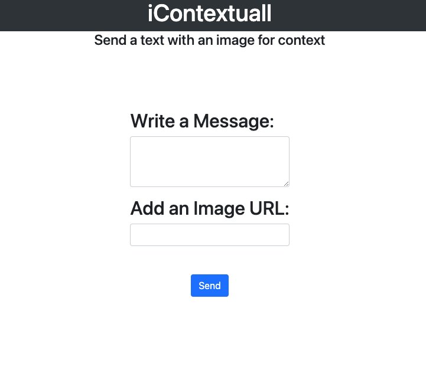

# iContextuall

## Description:
A basic browser-based GUI template for the Twilio SMS Python platform. You must add your own credentials (account_sid, auth_token, phone number, etc.). Links to the Twilio docs and other references are linked below. NOT DEPLOY READY.

## Technologies:
- Python
- Flask
- Twilio
- HTML5
- CSS3
- Bootstrap

## References:
// https://www.twilio.com/blog/2017/01/how-to-set-environment-variables.html
// https://www.twilio.com/docs/usage/secure-credentials
// https://www.twilio.com/docs/sms/quickstart/python
// https://flask.palletsprojects.com/en/1.1.x/installation/#installation
// https://www.youtube.com/watch?v=mqhxxeeTbu0